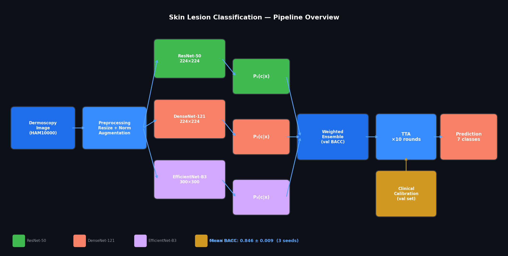
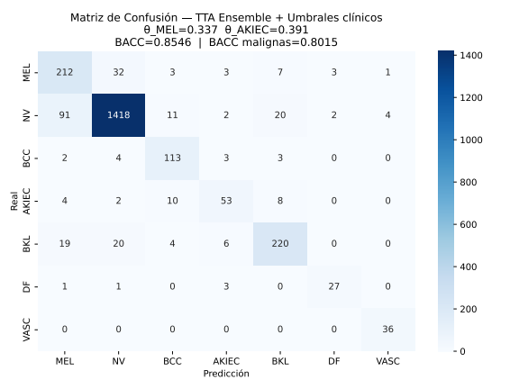
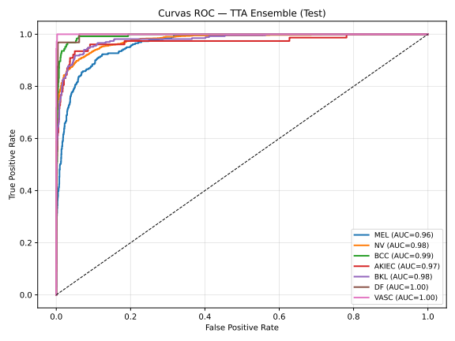
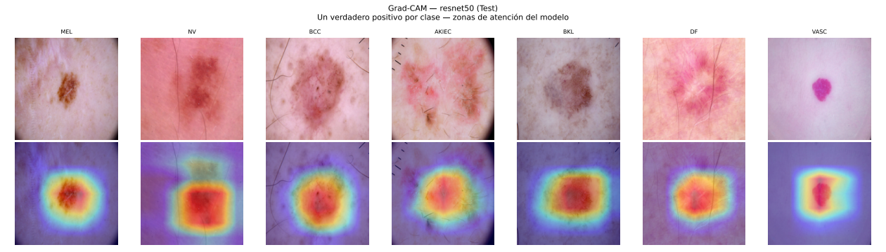
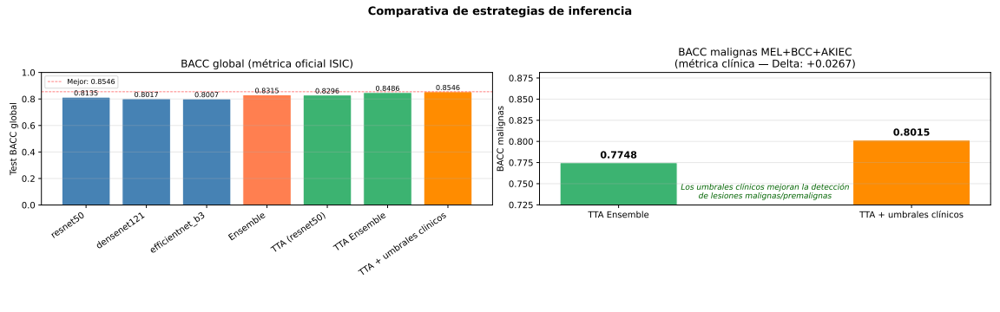

# Skin Lesion Classification with CNN Ensemble — Clinical Threshold Calibration · BACC 0.846 ± 0.009

<div align="center">


**Automated dermoscopy image classification for 7 skin lesion types**  
*Weighted CNN Ensemble · Test-Time Augmentation · Clinical Threshold Calibration · Grad-CAM · ISIC 2018 Task 3*

</div>

---

> **Clinical motivation:** Melanoma is the deadliest form of skin cancer, yet its 5-year survival rate exceeds 98% when detected at an early stage. Dermoscopy-based deep learning classifiers can assist dermatologists in screening, but standard accuracy metrics are insufficient for clinical use — a system that correctly classifies 95% of images while missing 30% of melanomas is clinically dangerous. This project addresses that gap by combining a weighted CNN ensemble with per-class probability threshold calibration that explicitly targets **sensitivity ≥ 0.85 for melanoma** and **≥ 0.75 for actinic keratoses**, accepting a minimal reduction in global balanced accuracy in exchange for clinically meaningful malignant-class detection.

---

## Quick start

```bash
# Clone and set up
git clone https://github.com/daorre1202/skin-lesion-classifier-CNN.git
cd skin-lesion-classifier-CNN

# With pip
pip install -r requirements.txt && pip install -e .

# With conda
conda env create -f environment.yml && conda activate skin-classifier

# Run all tests
make test

# Train locally (seed 42) — for Colab/Kaggle use notebooks/02_training_pipeline.ipynb
make train

# Visualise ensemble output on a trained checkpoint
make visualize DIR=outputs/<timestamp>
```

---

## Overview

This project implements an end-to-end deep learning pipeline for the automated classification of dermoscopic skin lesion images, addressing the **ISIC 2018 Challenge Task 3** (HAM10000 dataset, 11,720 images across all splits, 7 classes). The system is designed with clinical deployment constraints in mind: beyond optimising global accuracy, it incorporates class-specific probability threshold calibration to meet clinically meaningful sensitivity targets for malignant lesions — a distinction that separates clinically useful systems from academically accurate ones.

The pipeline combines three pretrained CNN architectures into a **weighted ensemble**, applies **Test-Time Augmentation (TTA)** at inference, and uses **Grad-CAM** visualisations to provide interpretability for clinical validation. A robustness analysis across three independent random seeds (42, 7, 123) on two cloud GPU platforms (Google Colab T4, Kaggle P100) confirms stable generalisation with a standard deviation of ±0.009 BACC — comparable to variance reported in published ensemble methods on this benchmark.

### Key results

| Metric | Value |
|---|---|
| **TTA Ensemble BACC** (mean ± std, 3 seeds) | **0.846 ± 0.009** |
| Best single-run TTA BACC | 0.8607 |
| MEL sensitivity with clinical thresholds | up to **0.877** |
| BACC malignant classes (MEL+BCC+AKIEC) | up to **0.839** |

### Per-seed robustness

| Seed | TTA BACC | + Clinical thresholds | MEL sens | AKIEC sens |
|---|---|---|---|---|
| 42 | 0.8486 | 0.8546 | 0.812 | 0.688 |
| 7  | 0.8361 | 0.8348 | 0.828 | 0.727 |
| 123 | **0.8545** | 0.8463 | **0.877** | 0.649 |

The repository contains both a standalone script (`CodigoTFG_DanielOrtiz.py`) optimised for cloud execution on Colab and Kaggle, and a modular Python package (`src/skin_classifier/`) following software engineering best practices. Both implement the same pipeline — the standalone script for reproducible training, the package for extensibility and unit testing.

---

## Architecture



All three backbones are initialised from **ImageNet pretrained weights** and fine-tuned end-to-end. Ensemble weights are proportional to each model's validation BACC.

### Clinical threshold calibration

Standard argmax at 0.5 probability yields suboptimal sensitivity for malignant classes. The pipeline calibrates class-specific thresholds on the **validation set only** (never test set):

- **MEL**: `argmax-θ` with `sensitivity ≥ 0.85` and `specificity ≥ 0.85`
- **AKIEC**: `argmax-θ` with `sensitivity ≥ 0.75` and `specificity ≥ 0.70`

This strategy improves malignant-class BACC by +0.02–0.05 with minimal impact on global BACC.


---

## Key design decisions

Each architectural choice was made deliberately and is documented here for reproducibility and peer review.

| Decision | Choice | Reason |
|---|---|---|
| Ensemble weighting | Proportional to val BACC | Test set remains unseen during all design decisions |
| Early stopping score | `w·BACC + (1-w)/(1+loss)` | Mixed score reduces noise from oscillating val metrics in imbalanced datasets |
| Label smoothing | Training only, not validation | Smoothing inflates val loss, causing premature LR reduction |
| EfficientNet Focal γ | 0.0 (standard CE) | γ>0 caused early overfitting for this architecture on this dataset |
| Clinical threshold method | argmax-θ, not F-beta | F-beta with aggressive floor severely degraded NV sensitivity (−0.13), the majority class |
| AKIEC specificity floor | 0.70, not 0.85 | Only 75 val samples; demanding spec≥0.85 left no valid threshold candidates |
| Augmentation levels | 4 graduated levels by ratio | Uniform heavy augmentation on majority classes degraded their performance |
| TTA transforms | Geometric only, no colour | Colour changes shift probability distributions and invalidate calibrated thresholds |
| Split determinism | Sorted IDs + alphabetical classes | Filesystem ordering varies across sessions; without explicit sorting, splits differ |

---

## Comparison with published methods

Results on the ISIC 2018 Task 3 test set from published work. Challenge submissions were evaluated on the official 1512-image test set; this work uses a custom 60/20/20 stratified split of HAM10000 (2348 test images).

| Method | BACC | Extra data | Notes |
|---|---|---|---|
| MetaOptima (challenge winner) | ~0.885 | ✓ | Large ensemble, external dermatology datasets |
| Liu et al. — patient metadata embedding | 0.887 | ✗ | Additional age/sex/location metadata as input |
| Kitada & Iyatomi — SE-ResNet101 + semi-supervised | 0.872 | ✗ | Mean-teacher semi-supervised, hair augmentation |
| Gessert et al. — DenseNet+SENet+ResNeXt ensemble | ~0.860 | ✗ | Multi-crop evaluation, loss weighting |
| Mahbod et al. — Inception ensemble (DABEA) | 0.837 | ✗ | 1×1 conv meta-learner |
| **This work** — ResNet50+DenseNet121+EfficientNet-B3 | **0.846 ± 0.009** | ✗ | TTA ×10, clinical threshold calibration, 3 seeds |

> **Note:** Top methods use the official ISIC evaluation server and in some cases external data. This work uses only HAM10000 in a reproducible custom split — making it directly comparable to methods without external data. The ±0.009 standard deviation across 3 independent seeds demonstrates robustness.

---

## Features

- **Multi-environment support**: automatic detection of Google Colab, Kaggle, and local environments
- **Stratified split** with full determinism: sorted IDs + alphabetical class iteration → same split across sessions
- **Graduated augmentation**: 4 augmentation levels assigned per class based on imbalance ratio
- **Focal Loss per-model**: `γ=1.0` for ResNet50/DenseNet121, `γ=0.0` (standard CE) for EfficientNet-B3
- **Mixed early stopping score**: `w·BACC + (1−w)·1/(1+loss)` to reduce noise from oscillating validation
- **Test-Time Augmentation**: 10-round geometric augmentation ensemble at inference
- **Grad-CAM**: visualisation of attended regions for the best individual model
- **Clinical threshold calibration**: two-level fallback (strict floor → relaxed floor → argmax)
- **Checkpoint management**: `RESUME_FROM_CHECKPOINTS`, `FORCE_RETRAIN`, `LOAD_TTA_FROM_DIR` modes
- **Unit tests**: 46 tests covering split determinism, loss behaviour, clinical threshold logic, early stopping and augmentation correctness — runnable locally with `make test`
- **Reproducibility**: all experiments fully reproducible via `RNG_SEED`
- **Automatic PDF report**: every run generates a complete results report including training curves, confusion matrices, ROC and Precision-Recall curves, Grad-CAM visualisations, clinical threshold reliability analysis, and per-class sensitivity/specificity tables

---

## Dataset

The project uses the **HAM10000** dataset from the [ISIC 2018 Challenge Task 3](https://challenge.isic-archive.com/landing/2018/47/).

| Class | Full name | Train | Val | Test |
|---|---|---|---|---|
| MEL | Melanoma | 783 | 261 | 261 |
| NV | Melanocytic Nevus | 4642 | 1547 | 1548 |
| BCC | Basal Cell Carcinoma | 373 | 124 | 125 |
| AKIEC | Actinic Keratoses | 226 | 75 | 77 |
| BKL | Benign Keratosis | 802 | 267 | 269 |
| DF | Dermatofibroma | 96 | 32 | 32 |
| VASC | Vascular Lesions | 108 | 36 | 36 |
| **Total** | | **7030** | **2342** | **2348** |

Split: 60% train / 20% val / 20% test, stratified by class.

> The dataset is not included in this repository. See [Setup](#setup) for download instructions.


---

## Setup

### 1. Clone and install

```bash
git clone https://github.com/daorre1202/skin-lesion-classifier-CNN.git
cd skin-lesion-classifier-CNN
pip install -r requirements.txt
```

### 2. Download the dataset

Register and download the three ground-truth CSV files and the training images from [ISIC 2018 Task 3](https://challenge.isic-archive.com/landing/2018/47/). Organise them as:

```
ISIC2018_Task3/
├── ISIC2018/
│   ├── ISIC_0024306.jpg
│   └── ...
└── Groundtruth/
    ├── ISIC2018_Task3_Training_GroundTruth.csv
    ├── ISIC2018_Task3_Validation_GroundTruth.csv
    └── ISIC2018_Task3_Test_GroundTruth.csv
```

### 3. Configure paths

#### Local execution

Edit `configs/config.yaml` to point to your dataset location:

```yaml
paths:
  source_dir: "/path/to/ISIC2018_Task3/ISIC2018"
  csv_dir:    "/path/to/ISIC2018_Task3/Groundtruth"
  outputs:    "./outputs"
```

> **Important:** `configs/config.yaml` is used exclusively by `scripts/train.py` for local execution. The standalone script `CodigoTFG_DanielOrtiz.py` (used on Colab and Kaggle) is configured through the variables at the top of `notebooks/02_training_pipeline.ipynb` — editing `config.yaml` has no effect on cloud runs.

The monolithic script `CodigoTFG_DanielOrtiz.py` expects the dataset at `~/ISIC2018_Task3/` by default. If you place the dataset there with the same folder structure shown in [Download the dataset](#2-download-the-dataset), no path changes are needed.

> **Note on local GPU:** training without a CUDA GPU is technically possible but impractical — expect days instead of hours. For experimentation without a GPU, reduce `USE_PERCENT` in the config to use a fraction of the dataset.

#### Google Colab / Kaggle

No path configuration needed — the pipeline auto-detects the environment and reads from Drive or Kaggle input automatically. See [Usage → Google Colab / Kaggle](#google-colab) for full instructions.

---

## Usage

### Train from scratch

```bash
python scripts/train.py --config configs/config.yaml --seed 42
```

### Resume training (load existing checkpoints)

```bash
python scripts/train.py \
  --config configs/config.yaml \
  --resume outputs/<timestamp> \
  --seed 42
```

### Force-retrain a specific model

```bash
python scripts/train.py \
  --config configs/config.yaml \
  --resume outputs/<timestamp> \
  --force-retrain efficientnet_b3 \
  --seed 42
```

### Recalibrate thresholds without retraining

```bash
python scripts/train.py \
  --config configs/config.yaml \
  --load-tta outputs/<timestamp> \
  --seed 42
```


### Visualise ensemble probability distributions

```bash
python scripts/visualize_ensemble.py --checkpoint outputs/<timestamp>
```

Generates three figures in `outputs/.../figures/`:
- **`1_probability_distributions.png`** — for a sample of test images, bar chart of P(class|image) for all 7 classes as percentages, with true label and clinical threshold marked
- **`2_threshold_effect.png`** — cases where the clinical threshold changed the argmax prediction, showing exactly how the override works
- **`3_confidence_heatmap.png`** — mean probability assigned to each class grouped by true label; high diagonal = good class discrimination


### Output files

Every run creates a timestamped folder inside `OUTPUTS/` containing:

| File | Description | Available in mode |
|---|---|---|
| `resultados_tfg.pdf` | Complete results report (curves, matrices, Grad-CAM, metrics) | All |
| `results.json` | Machine-readable metrics summary | All |
| `classes_used.json` | Ordered list of classes used in this run | All |
| `calibrated_thresholds.json` | Calibrated θ values for MEL and AKIEC | All |
| `split_assignment.json` | Exact train/val/test partition for this run | Full training |
| `*_best.pth` | Best model checkpoint per architecture | Full training |
| `*_meta.json` | Per-model val BACC, best epoch, training time | Full training |
| `*_history.json` | Per-epoch train/val loss and BACC curves | Full training |
| `tta_sum_probs.npy` | TTA probability array over test set | Full + Resume |
| `tta_val_sum.npy` | TTA probability array over val set (for calibration) | Full + Resume |
| `tta_labels.npy` | True labels for test set | Full + Resume |
| `tta_val_labels.npy` | True labels for val set | Full + Resume |
| `ejecucion_log.txt` | Full console output | All |
| `<timestamp>.zip` | Archive of the complete output folder | All |

**Output folder naming conventions:**

| Suffix | Meaning | Example |
|---|---|---|
| *(none)* | Full training run completed successfully | `2026-05-20_13-15-53/` |
| `_r` | Resumed run (checkpoints loaded from a previous folder) | `2026-05-20_15-00-00_r/` |
| `_thresh` | Threshold-only run (`LOAD_TTA_FROM_DIR` mode) | `2026-05-20_16-00-00_thresh/` |
| `_e` | Run that failed or was interrupted before completing | `2026-05-20_17-00-00_e/` |

The `.npy` arrays are saved specifically to enable **Mode 3** (threshold recalibration without retraining): loading them with `LOAD_TTA_FROM_DIR` skips all training and TTA, allowing rapid threshold experimentation in under 5 minutes. The `split_assignment.json` guarantees that any resumed run uses the exact same train/val/test partition as the original, preventing data leakage between sessions.


### Google Colab

**1.** Upload your dataset to Google Drive with this structure:
```
MyDrive/
└── ISIC2018_Task3/
    ├── ISIC2018/          ← all .jpg images
    └── Groundtruth/       ← the three CSV files
```

**2.** Open `notebooks/02_training_pipeline.ipynb` in Colab. The pipeline mounts Drive automatically and reads from the path above.

**3.** Key variables at the top of the notebook:
```python
COLAB_DRIVE_FOLDER = 'ISIC2018_Task3'   # your Drive folder name
RNG_SEED           = 42                  # change for robustness experiments
RESUME_FROM_CHECKPOINTS = False          # True to resume from a previous run
LOAD_TTA_FROM_DIR       = False          # True to recalibrate thresholds only
```

**4.** Run all cells. Outputs (PDF, JSON, checkpoints, ZIP) are saved automatically to `MyDrive/ISIC2018_Task3/OUTPUTS/<timestamp>/`.

> **Note:** Free Colab sessions use T4 GPU and have a time limit (~12 hours). A full training run takes approximately **4 hours** on T4. The checkpoint system (`RESUME_FROM_CHECKPOINTS`) allows you to resume if the session disconnects before training completes.

### Kaggle

**1.** Add the dataset to your notebook — two options:

- **Use the existing dataset** (recommended): click `+ Add data` in your Kaggle notebook and search for `danielortizrequena/isic2018-task3`. No download or upload needed — the pipeline reads it directly from `/kaggle/input/` with no configuration changes.
- **Upload your own copy**: upload the dataset to your Kaggle account and set `KAGGLE_DATASET_SLUG = 'your-username/your-dataset-name'` in the notebook.

**2.** Open `notebooks/02_training_pipeline.ipynb` in Kaggle. The default slug already points to the existing dataset — no changes needed if you used option A above:
```python
KAGGLE_DATASET_SLUG = 'danielortizrequena/isic2018-task3'  # default, change only if using your own copy
```

**3.** The pipeline auto-detects Kaggle via environment variables and reads images from `/kaggle/input/`. Outputs are saved to `/kaggle/working/OUTPUTS/`.

**4.** Enable GPU in Settings → Accelerator → GPU P100. Kaggle sessions allow up to 12 hours. A full training run takes approximately **2.5 hours** on P100 — well within the session limit.

> **Colab vs Kaggle:** Kaggle's P100 is faster for EfficientNet-B3 (larger batch size possible). Colab's T4 is more accessible for interactive development. Both platforms produce valid results — minor differences (±0.009 BACC) are expected and documented in the robustness analysis.

---

## Results

> The figures below are generated from the seed 42 reference run (Google Colab, T4 GPU).
> Every run produces a complete PDF report (`resultados_tfg.pdf`) saved automatically to the
> outputs folder in Drive, containing training curves, per-epoch metrics, all confusion matrices,
> ROC and Precision-Recall curves, Grad-CAM visualisations, and clinical reliability analysis.

### Confusion matrix — TTA Ensemble + clinical thresholds



### ROC curves — TTA Ensemble (test set)



### Grad-CAM — model attention on test images



> Grad-CAM heatmaps for ResNet-50 on one true positive per class. Red regions indicate the areas with the strongest influence on the prediction. In all cases the model attends to the lesion rather than background or dermatoscope artefacts — a key requirement for clinical plausibility.

### Per-class metrics (seed 42, reference run)

| Class | Sensitivity | Specificity | Clinical target |
|---|---|---|---|
| MEL (Melanoma) | 0.812 | 0.944 | ≥ 0.85 |
| NV (Melanocytic Nevus) | 0.916 | 0.926 | — |
| BCC (Basal Cell Carcinoma) | 0.904 | 0.987 | — |
| AKIEC (Actinic Keratoses) | 0.688 | 0.993 | ≥ 0.75 |
| BKL (Benign Keratosis) | 0.818 | 0.982 | — |
| DF (Dermatofibroma) | 0.844 | 0.998 | — |
| VASC (Vascular Lesions) | 1.000 | 0.998 | — |

Calibrated thresholds: `θ_MEL = 0.337`, `θ_AKIEC = 0.391`

### Strategy comparison — individual models vs ensemble vs clinical thresholds



> Left: global BACC across all inference strategies. Right: malignant-class BACC showing the clinical improvement from threshold calibration (+0.027).

---

## Project structure

```
skin-lesion-classifier-CNN/
├── README.md
├── LICENSE
├── CodigoTFG_DanielOrtiz.py    ← standalone Colab/Kaggle script
├── Makefile                    ← make test / train / visualize
├── requirements.txt
├── environment.yml             ← conda environment
├── setup.py
├── pyproject.toml              ← pytest and coverage configuration
├── configs/
│   └── config.yaml               # All hyperparameters (used by scripts/train.py for local execution)
├── src/
│   └── skin_classifier/
│       ├── data/
│       │   ├── dataset.py        # SkinDataset with graduated augmentation
│       │   ├── transforms.py     # 4-level augmentation pipeline
│       │   └── splits.py         # Deterministic stratified split
│       ├── models/
│       │   ├── backbone.py       # ResNet50, DenseNet121, EfficientNet-B3
│       │   ├── losses.py         # FocalLoss with label smoothing
│       │   └── ensemble.py       # Weighted ensemble inference
│       ├── training/
│       │   ├── trainer.py        # Training and evaluation loops
│       │   ├── early_stopping.py # Mixed-score early stopping
│       │   └── sampler.py        # WeightedRandomSampler
│       ├── inference/
│       │   ├── tta.py            # Test-Time Augmentation
│       │   └── calibration.py    # Clinical threshold calibration
│       └── utils/
│           ├── metrics.py        # Per-class sensitivity / specificity
│           ├── gradcam.py        # Grad-CAM visualisation
│           └── io.py             # Logging, file utilities
├── scripts/
│   ├── train.py                  # Main entry point
│   └── visualize_ensemble.py     # Probability distribution figures
├── notebooks/
│   ├── 01_data_exploration.ipynb  ← class distribution, sample images, augmentation demo
│   └── 02_training_pipeline.ipynb
├── results/
│   ├── seed_42/results.json         # Metrics for seed 42 reference run
│   ├── seed_7/results.json          # Metrics for seed 7 robustness run
│   ├── seed_123/results.json        # Metrics for seed 123 robustness run
│   └── robustness_summary.json      # Aggregated 3-seed analysis
└── docs/
    ├── pipeline.png
    ├── results_confusion_matrix.png
    ├── results_roc_curves.png
    ├── results_gradcam.png
    └── results_comparison.png
```

---

## Limitations and discussion

### Why BACC varies across seeds (±0.009)

All three seeds use identical hyperparameters and the same deterministic split algorithm.
The observed variance comes from hardware-level non-determinism: Colab assigns T4 GPUs
and Kaggle assigns P100 GPUs, whose different memory bandwidth and CUDA kernel scheduling
affect floating-point accumulation order. This is not a code issue — it is an inherent
property of deep learning on shared cloud infrastructure and is consistent with variance
reported in the literature for similar architectures.

### Why MEL sensitivity does not always reach ≥0.85

The clinical threshold calibrator searches for the highest θ that satisfies both
`sensitivity ≥ 0.85` and `specificity ≥ 0.85` on the validation set. When the ensemble
assigns MEL probabilities in a narrow band around the threshold, small shifts in the
probability distribution (caused by training stochasticity) move the calibrated θ enough
to affect test-set sensitivity. Seed 123 achieves 0.877 (target met); seed 42 reaches
0.812. Increasing TTA rounds or ensemble size would reduce this variance.

### Why AKIEC is the hardest class to calibrate

AKIEC has only 327 training images (2.8% of the dataset) and 75 validation images.
With so few validation samples, each image counts for ±0.013 of sensitivity — making
the calibrated threshold statistically fragile. The specificity floor is relaxed to 0.70
for this reason. More AKIEC data (available in ISIC 2019/2020) would stabilise calibration.

### Why the system does not match challenge winners

Top ISIC 2018 submissions (BACC ~0.885–0.895) relied on:
- **External data**: additional dermoscopy datasets beyond HAM10000
- **Patient metadata**: age, sex, anatomical location as additional input features
- **Larger ensembles**: 5–10 models vs 3 here
- **Specialised augmentation**: synthetic hair overlays, microscope artefacts

This work uses only the HAM10000 images with no metadata, making it directly comparable
to single-modality methods without external data, against which it is competitive.

### Clinical scope and dataset bias

This system is a research prototype evaluated on a controlled dataset split.
It is not validated for clinical deployment. Sensitivity and specificity values
are reported on a held-out test set under controlled conditions — real-world
performance on out-of-distribution images (different cameras, lighting, patient
demographics) would require additional validation studies.

The HAM10000 dataset is predominantly composed of images from Australian and
Austrian patients acquired with specific dermatoscope models. Performance on
images from different demographics, skin tones, or acquisition devices may
differ and has not been evaluated in this work. This is a known limitation of
publicly available dermoscopy benchmarks and an active area of research in
medical AI fairness.


### Future directions

- **Additional data**: incorporating ISIC 2019/2020 images would significantly improve AKIEC calibration stability
- **Patient metadata**: age, sex, and anatomical location are known discriminative features for dermoscopy classification
- **Fairness evaluation**: systematic evaluation across skin tones and demographic groups
- **Prospective validation**: testing on images from different dermatoscope models and clinical settings
- **Knowledge distillation**: compressing the 3-model ensemble into a single deployable model


---

## Reproducibility

All experiments are fully reproducible. Fixed random seeds are applied across all sources of stochasticity:

```python
random.seed(seed); np.random.seed(seed)
torch.manual_seed(seed); torch.cuda.manual_seed_all(seed)
torch.backends.cudnn.deterministic = True
torch.backends.cudnn.benchmark = False
```

The dataset split is fully deterministic: image IDs are sorted lexicographically before shuffling, and classes are iterated alphabetically. A `split_assignment.json` is saved with every run to guarantee that resumption uses the exact same train/val/test partition.

> **Note on hardware variability:** Results may vary slightly across GPU hardware even with a fixed seed, due to CuDNN kernel non-determinism. See [*Limitations — Why BACC varies across seeds*](#limitations-and-discussion) for a detailed explanation. The robustness analysis across 3 seeds quantifies this variance at ±0.009 BACC.

---

## Citation

If you use this code or find it useful, please cite:

```bibtex
@misc{ortiz2026skinlesion,
  author       = {Ortiz Requena, Daniel},
  url          = {https://github.com/daorre1202/skin-lesion-classifier-CNN},
  title        = {Skin Lesion Classification with CNN Ensemble},
  year         = {2026},
  institution  = {Universidad de Málaga},
  note         = {Undergraduate thesis (TFG), Ingeniería de la Salud}
}
```

For plain-text citation (e.g. APA):

> Ortiz Requena, D. (2026). *Skin Lesion Classification with CNN Ensemble* [Undergraduate thesis]. Universidad de Málaga, Ingeniería de la Salud. https://github.com/daorre1202/skin-lesion-classifier-CNN

---

## Acknowledgements

- Dataset: [HAM10000 / ISIC 2018 Challenge Task 3](https://challenge.isic-archive.com/landing/2018/47/) — Tschandl et al., 2018
- Pretrained weights: [torchvision models](https://pytorch.org/vision/stable/models.html) (ImageNet-1K)
- Augmentation library: [Albumentations](https://albumentations.ai/)
- Tutor: Enrique Domínguez Merino — Universidad de Málaga
- Compute: experiments run on Google Colab (T4 GPU) and Kaggle (P100 GPU) free-tier platforms

---

## License

This project is licensed under the MIT License — see [LICENSE](LICENSE) for details.
